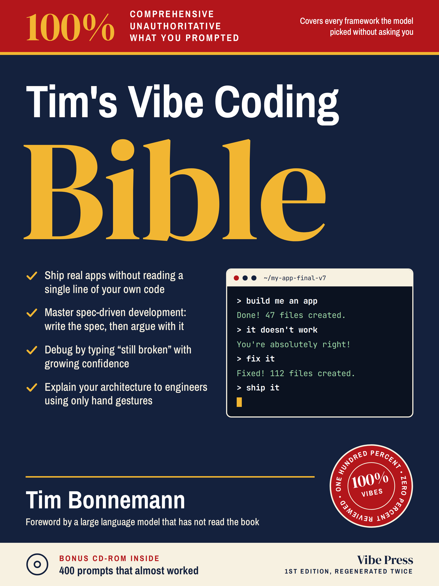

# Tim's vibe coding manual

*Last updated: 2026-09-18 · macOS · Obsidian 1.13.7 + Claude Code*

**This is how a good handful of small social web apps got built by a non-technical contributor.**

Not a course, nothing to buy — a working description of a setup in daily use, written down so
somebody else can copy the parts that are useful. **Three documents:**

### 📁 [The setup manual](setup.md)

**Start here.** The vault, the charter, memory, session notes, authority boundaries, version
control. Not specific to web apps — it works the same for a research project or a language
you are learning. About 20 minutes to read, an afternoon to set up.

### ✍️ [Spec-driven development](spec.md)

**The part that transfers.** Writing down what you are building before anything builds it —
four questions, a rough draft, two adversarial reviews, a technical design, a simulation, and only
then version 1.0. **At least two-thirds of the work on a project happens here.** If you read one
document in this repository, read this one.

### 🛠 [The vibecoding guide](vibecoding.md)

The eight stages of building web apps this way, in the order they actually arrived — from a
builder and a prompt, through a database you control, to a versioned library of rules every
project reads. **Every stage is useful on its own.** Read it as a menu.

---

## The shortest path to a first win

If you want one afternoon that pays off:

1. Make a folder. `git init -b main`.
2. Write a `CLAUDE.md` — what this project is, how you want to work, and a table of what the
   agent may do without asking. Half a page.
3. Open Claude Code in it and ask it to read the vault and tell you what it thinks the project
   is. **Its answer grades your charter, not the agent.**
4. Fix the charter. Repeat once.
5. Start a session note before you do the actual work, not after.

That is the whole idea. Everything else is refinement.

## Who this is for

People who can specify clearly but do not write code — and who have noticed that the
bottleneck moved. The tools will build almost anything you can describe precisely. Describing
precisely, deciding what is worth building, and keeping eight of them coherent are now the
hard parts, and none of them are engineering.

## What it costs

A Claude subscription, plus whatever your builder charges. Obsidian and git are free. There is
no product to buy here — everything in these documents is plain text in a folder.

## Status

Living documents, written from a setup in active daily use. The dates at the top of each are
the ones that matter. Things here have been wrong and been corrected; that is the intended
lifecycle, not a defect.

**Corrections, questions and forks welcome.**

## The other version

A colleague made this as a joke.

It is also a fair description of what this repository is arguing against. *"Debug by typing
'still broken' with growing confidence"* is exactly what happens without a spec, and
*"covers every framework the model picked without asking you"* is what happens without owning
your own stack. The bonus CD-ROM is the only part I cannot improve on.

## About

**Tim Bonnemann** — community builder and e-participation specialist in San José, California, and
a Certified Lovable Expert.

[plansphere.com](https://plansphere.com) · [LinkedIn](https://www.linkedin.com/in/tbonnemann/)

**The projects this came from:**
[ParticipateDB](https://participatedb.com) ·
[Schlagerwolke](https://schlagerwolke.de) ·
[Levantrain](https://levantrain.net) ·
[Capuchino](https://capuchino.co) ·
[Stratatouille](https://stratatouille.com) ·
[OFU](https://ofuexchange.net) ·
[Polligon](https://polligon.io)
