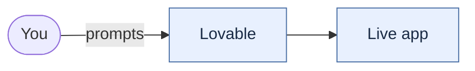
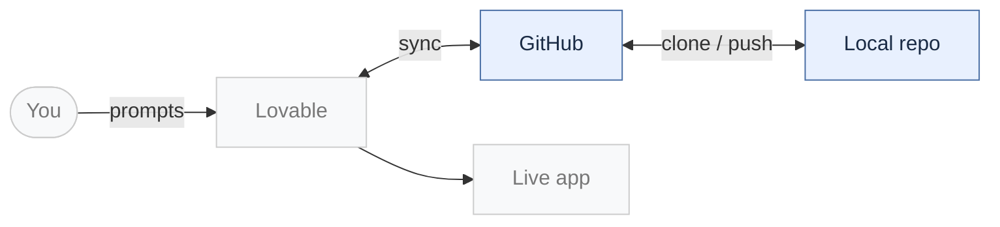
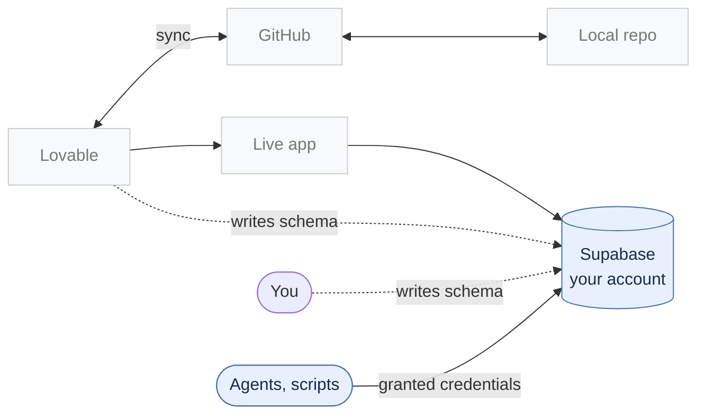
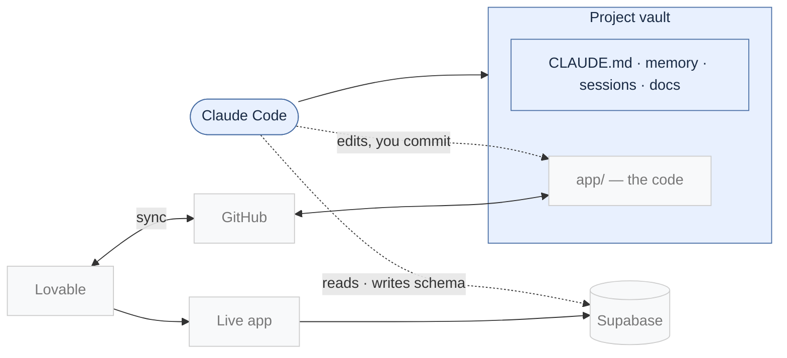
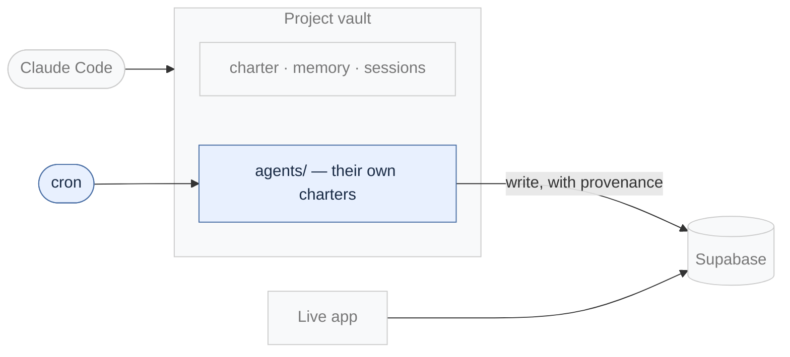
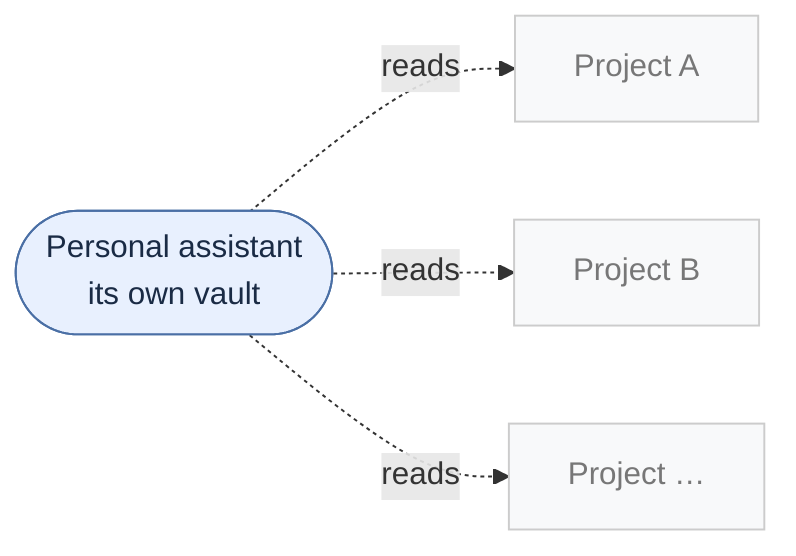
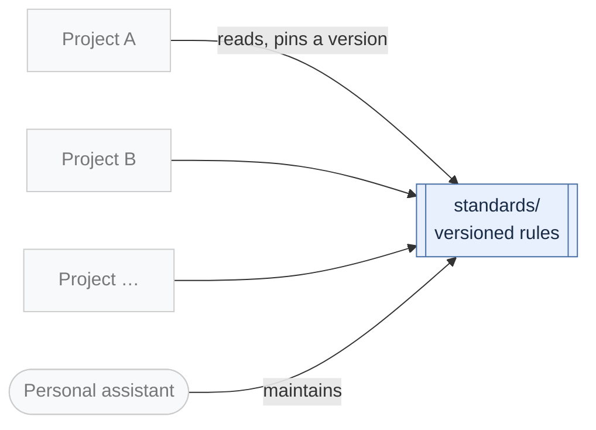
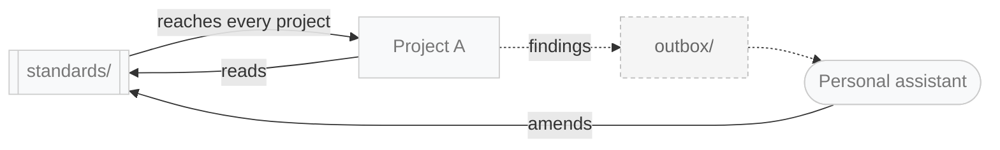

# The vibecoding guide

> How to take full advantage of AI-assisted web development tools as a non-technical contributor
> — one stage at a time, in the order things actually arrived.

*Last updated: 2026-09-18 · Companion to [the setup manual](setup.md)*

**Read this as a menu, not a ladder.** Every stage below was useful on its own, often for
months. Nothing here needs the stage after it. Each one got added when a new *want* appeared —
not because the previous setup was broken.

Stage 4 is the big one and lives in its own document: **[the setup manual](setup.md)**.

**But read the section before Stage 1 first.** The specs came before any of the stages did, and
they are the part that would still be worth doing if every tool here disappeared.

---

## The stages at a glance


| | Stage | What it unlocks |
|---|---|---|
| 1 | Lovable | shipping real apps without writing code |
| 2 | GitHub + local repo | editing without spending builder credits, and a copy you own |
| 3 | Standalone Supabase | full database access — and the ability to grant an agent write credentials |
| 4 | **Vault + Claude Code** | an architect with the whole context, not just the code |
| 5 | Agents on cron | the database grows itself, overnight |
| 6 | Personal assistant | comparing and deciding across projects |
| 7 | Standards library | write a rule once, adopt it by version |
| 8 | Project→assistant messaging | alignment maintained in the background *(pending)* |

---

---

# Before any of it: the spec

**→ [Spec-driven development](spec.md)** — its own document, because it is the longest and the
most transferable part of this.

**The short version:** an AI builder will never tell you your requirements are ambiguous. It picks
a reading and implements it beautifully, and you meet that decision weeks later when the behavior
is load-bearing. **Every ambiguity you leave becomes a decision somebody else made for you.**

So: four questions, a rough draft, a list of everything it exposed, two different adversarial
reviews, a technical design, a simulation — and only then version 1.0. **At least two-thirds of the
work on a project happens before any code exists**, often closer to eighty percent.

---

## Stage 1 — Lovable



**What it unlocks.** You describe what you want and a working, deployed web app appears.
Not a mockup — a real one, with a database behind it and a URL you can send to someone.

For anyone who has had ideas for years and no way to build them, this is the whole ballgame,
and it stays impressive after the novelty wears off.

**How to start.** Describe the app in a few paragraphs, then iterate in the chat. Publish
early — a deployed thing you can show is worth more than a better thing you cannot.

**What it made possible to want.** Two things, both of which point at stage 2:

- **Do it more, and cheaper.** Every message costs credits, including the small ones —
  a typo, a padding change, a copy tweak.
- **Hold a copy of your own code.** Not a criticism of anyone. If a project matters, you want
  its source somewhere you control.

---

## Stage 2 — GitHub and a local repo



**What it unlocks.** Lovable syncs to a GitHub repo; you clone it. Now changes can be made
locally and pushed back, and Lovable picks them up. Small edits stop costing credits, and the
source lives somewhere you own.

**How to set it up.** Connect GitHub from Lovable's project settings, then clone the repo to
your machine. Read the sync direction carefully once — the builder pushes to the same branch
you do, so **fetch before you start** and expect to resolve the occasional divergence.

**One thing that used to belong here and no longer does.** Until 2026, a builder's stock output
was a client-rendered single-page app — fine to use, invisible to search engines and link previews,
because the content only existed after JavaScript ran. Migrating off that was real work and several
of my projects paid for it.

**Lovable made server-side rendering the default for new apps on 13 May 2026**, and made existing
ones crawler-readable. If you are starting now, you start where the rest of us ended up. I mention
it because the *lesson* outlived the problem — see
[the spec page](spec.md#why-this-is-worth-the-effort--one-line-of-evidence).

**What it made possible to want.** If the code is on your machine, something on your machine
can read it — which is stage 4.

---

## Stage 3 — A standalone Supabase project



**What it unlocks.** The app's database lives in a Supabase project **in your own account** —
not one your builder manages for you. That means the dashboard, the SQL editor, the CLI, and
most importantly **the ability to issue credentials to something that isn't you**.

**That last one is the door to stage 5, and it is where I found out the hard way.** When I
started the project that would be maintained by overnight agents, the database was on the
builder's managed backend — and there was no way to issue those agents write credentials. An
agent that writes to your database needs write access to your database. If you cannot grant
that, you cannot have the agent, and no amount of cleverness elsewhere gets around it.

So the project got a standalone Supabase project instead, in an account I control. The dates
say how quickly: the vault and the first agent on one day, the second agent and the standalone
database the next.

**This is the stage I would most argue for if you only take one.** Everything from stage 5
onward depends on being able to hand a credential to something that isn't you.

**How to set it up.** Create the Supabase project first, then connect it from the builder.
Note the project reference, and **link the CLI on day one**:

```bash
supabase link --project-ref <your-ref>
supabase migration list --linked
```

Do it while there is nothing to lose. A database you cannot reach from the command line is
fine for a week and a genuine problem six months in, when it holds data you cannot reproduce
and a schema nobody has ever compared against the repo.

> ### ⚠️ The problem you have just signed up for
>
> *An aside, not a step. Skip it until something stops adding up — then come back.*

Two parties could already change the code." Now **three can change the database** — you, the
builder, and later the agents — and nothing reconciles them. This is the largest body of hard-won
practice in my whole setup, so here is its shape.

**SQL reaches a database by several routes, and they leave different traces:**

| Route | What happens | What it leaves |
|---|---|---|
| 1 | the builder writes and applies a migration | a file *and* a ledger row |
| 2 | the builder applies *your* file, stamping its own version | the same change filed twice |
| 3 | somebody pastes into the SQL editor | a schema change **no file describes** |
| 4 | a file that was never applied | code shipping ahead of the schema |
| 5 | you apply your own files deliberately | file and row, matching |

**Route 3 is the one that hurts**, because nothing else in your tooling can see it. **Route 4 is
the one that bites in public**: code deploys, the database does not, and signed-in pages come up
empty while every check reports green.

**No single check covers it.** Each compares a different pair:

| Check | Compares | Catches |
|---|---|---|
| `git fetch`, *then* `git status` | repo vs remote | somebody else edited the files |
| a drift check | repo vs ledger | a file that was never applied |
| `db diff` | repo vs live schema | a change with no file — route 3 |
| rebuild from empty | files vs a fresh database | the files no longer reproduce reality |
| regenerate types | database vs your code | code compiled against a stale schema |

I wrap those into two commands: one at the start of a session, one before every publish.

**Three things learned expensively:**

- **Clean bookkeeping does not mean the recipe works.** One project's ledger read *20 of 20
  applied* and could not rebuild its database from those files at all.
- **"Could not determine" must never look like "no problem."** My drift check has three exit codes
  for this: in sync, drifted, and *could not tell.* Collapsing the third into the first turns a
  failure to ask into an answer of no.
- **Where a change's effect is observable, probe the effect.** Bookkeeping cannot tell you whether
  a permission change actually ran. Calling the thing as an anonymous user and reading the error
  code can.

**What it made possible to want.** Two authors could already change the code. Now two or three
can change the *schema* — you, the builder, and later the agents — and nothing reconciles them
automatically. That is a solvable bookkeeping problem, and worth knowing you have signed up
for it.

### The stack this ends up as, and why the separation matters

By the time all of this settles, the pieces are deliberately owned by different parties:

| | |
|---|---|
| **Lovable** | builds and hosts the app |
| **GitHub** | the code — mine |
| **Supabase** | the database, my own project, not the builder's managed one *(stage 3)* |
| **Resend** | transactional email |

**There is no single vendor here I could not walk away from.** A different builder, self-hosting,
or somebody else taking over development — the code, the data and the email all already belong to
me. That is not a hypothetical benefit; it mattered more than once this year, and Core Requirements
calls it vendor portability for a reason.

---

## Stage 4 — The vault, and Claude Code inside it



**What it unlocks.** The builder only ever sees the code. A vault holds everything it does
not: the product spec, the technical design, the decisions you made and rejected, the research,
the session history. Put Claude Code in that folder and you stop having a coding assistant and
start having something closer to an architect — one that can answer *"why is it like this"*
because the answer is in a file it has read.

**Three things arrive with it**, and they are the reason the stage is worth its own document:

- **Persistence** — memory files and session notes. The difference between a smart session and
  an assistant that knows your project.
- **Authority boundaries** — an explicit table of what it may do without asking. This is what
  makes stages 5 through 8 safe rather than reckless.
- **The vault under version control** — the code was already backed up through GitHub. The
  vault is the part that exists only on your laptop.

**Two builders, both fully onboarded.** This is the part the diagram is trying to show and the
part people miss: the agent in the vault is not a commentator. It reads and edits the code
alongside the builder, and it reaches the database directly — running migrations, or handing you a
command to run in the terminal when something needs your hand on it. Lovable and Claude Code are
both doing development work on the same project, from different angles.

**→ [The setup manual](setup.md) is the whole of this stage.**

**What it made possible to want.** Once one project has this, the others visibly do not. And
each vault accumulates its own conventions in isolation — which is stages 6 and 7.

---

## Stage 5 — AI agents on a schedule



**What it unlocks.** The database grows while you sleep. **The work they do is web search, web
research, and data processing** — find candidate sources, read pages, extract structured facts,
resolve them against what is already there, and write the result.

Agents run locally on a schedule. Nothing is hosted; the laptop has to be on.

The concrete version: one project's dataset went from a seed to tens of thousands of sourced
records this way, built by two agents with distinct jobs — one that decides what is worth
reading, one that reads it and records every claim it finds.

**How to set it up.** Each agent gets its own charter, the same way you do — what it is, what
it may write, what it must record. Give them narrow, separable jobs; two small agents that
hand off beat one that does everything, because you can tell which one is wrong.

**If the agents write data: provenance from day one.** Every record carries where it came from and
how confident the agent was. Retrofitting that means re-crawling everything. *(This one matters if
your project is a dataset. Skip it if the agents are doing something else.)*

**What it made possible to want.** Unsupervised writes raise a question that does not come up
anywhere else: **who watches the watcher?** A health check that is disabled alongside the thing
it monitors turns silence into a signal that everything is fine. Ask what a failure would
*look* like before you trust a quiet dashboard.

---

## Stage 6 — A personal assistant across projects



**What it unlocks.** A vault of its own, with an agent whose job is not one project but *the
portfolio*: compare, evaluate, prepare, decide. It is the thing that can answer "which of these
is furthest along," "what did we decide about X across all of them," and "is this a real problem
or did I just meet it twice."

It also holds the work that belongs to no single project — the writing, the personal site, the
calendar of what is due when.

**How this actually happened, which is not how I would have planned it.** This vault was my
*first* — it predates every project in the portfolio. It started as a personal assistant, got
renamed once it had a personality, and only later did I realise the interesting thing it could do
was look at all the other vaults at once. The supervisor role was a discovery, not a design.

**How to set it up.** Exactly like stage 4, one level up. Its own vault, its own charter, its
own memory. **It reads the projects; the projects do not read each other.** Hub and spoke, and
the spokes stay unaware of one another on purpose.

**What it made possible to want.** The first thing comparison reveals is that the same problem
has been solved eight different ways, each defensible, none written down. That is stage 7.

---

## Stage 7 — A standards library



**What it unlocks.** Write a rule once, in one document, with a version number. Projects
reference it by name and version rather than restating it. When the rule improves, the version
moves and existing references keep pointing at what they were written against — so upgrading is
a deliberate act, project by project, not something that happens to you.

What ends up in it is unglamorous and load-bearing: how a database schema stays honest when
three parties can change it, what a security baseline actually requires, how to review code an
AI wrote, how to write a project charter, what US English means here.

**How to set it up.** Start with the rule you have now explained twice. Give it a version
number and a date. Add the evidence — *which project hit this, and what happened* — because a
standard assembled from taste is one nobody follows, and evidence is what makes a rule
checkable later.

### The mechanics that make it hold together

- **Every document has a version and a changelog line.** Never edit one without at least a patch
  bump — if it was worth editing, it was worth recording. I have broken this myself and had a
  project catch me.
- **A project pins a version *and a date*.** The number alone does not say which text was read,
  and on a day of heavy revision that is the whole question.
- **A patch never changes what conforms.** That contract is what makes a pin worth having: pinned
  at v1.1, you are covered through v1.1.x and owe no re-read. A minor bump means *look*.
- **Applicability is a condition about what is at stake, never a category of project** — *it has a
  database*, *it serves a second language*, *real people can lose something*. A category can only
  be belonged to; a condition can be checked. **This is what lets a one-page site and a nine-table
  app read the same library** without the small one drowning in ceremony. "Does not apply here" is
  conformance, not an exemption.
- **A standard describes a pattern; it never tracks who has adopted it.** Adoption status goes
  stale within days and gets read as current. Keep project state in the project.
- **Anything a project must follow has to live where that project can read it.** A rule filed
  somewhere outside its reach is unfollowable *and* its absence is unreportable. Obvious, and I
  have violated it four times — twice in the week after writing the rule down.

**What earns a place:** a rule when it recurs across projects *and* has a precedent to point at.
Every entry names the incident it came from. A library assembled from taste rather than evidence is
one nobody follows, including its author.

**What it made possible to want.** A library only helps if projects notice it changed. Doing
that by hand across eight vaults is exactly the kind of task that gets skipped.

---

## Stage 8 — Project→assistant messaging *(pending)*



**⚠️ As of 18 September 2026 this stage is still in progress. Treat what follows as a design, not
a recommendation.**

**What it aims at.** Each project checks itself against the library on a schedule and writes
what it finds to its own outbox. The assistant reads those, and where a finding generalizes,
amends the standard — which then reaches every other project. A defect found once gets fixed
everywhere.

**What already works:** the loop run by hand produces real corrections, including projects
contradicting rules they had themselves contributed days earlier. **What does not yet:** it
still needs a person to start each round.

### How a round actually runs

1. **List the library, reading each version from the document's own header** — never from an index.
   Mine was ten versions stale once, with five projects reading it mid-round.
2. **Set-difference your tracking table against the library.** *A missing row is invisible.* A
   behind row prints a warning; a standard you never listed prints nothing, and an all-current
   table of six rows against a library of thirteen reads as fully aligned.
3. **For each row behind, read the changelog between your marker and current**, and decide per
   entry whether it creates work here. **Record the "no" answers and what they depend on** — a "no"
   that is not written down gets re-decided every round, and the next reader cannot tell
   *considered and not applicable* from *never looked*.
4. **Advance the marker and date it**, including on a pass that creates no work.
5. **File anything that generalizes.** Three kinds: a **finding** (something true that travels), a
   **conflict** (a standard is wrong, or unachievable on your platform), a **gap** (a real
   situation nothing covers). Conflicts are the most valuable — on the loop's first day five were
   filed and all five changed the library.
6. **Report; do not do the work you find.** Surfacing and fixing are different jobs.

**Two habits I did not expect to need:**

**Before recording a "no", ask what a "yes" would have looked like.** If you cannot describe the
output that would have contradicted you, you have not tested anything — you have watched a tool
decline to speak about a subject it never covers. One project withdrew its own morning reassurance
on exactly these grounds.

**Check a rule's premise before borrowing its conclusion.** A project matched its symptom to one of
my rules and inherited a conclusion reached about a different case. One command would have shown
the premise absent. My text was too loose and I fixed it — but the project's verdict on itself was
better than mine: *the text licensed the shortcut; taking it was still a choice I could have
declined.*

### When you have monitors, four more

*These only start mattering once something is checking on a schedule rather than when you look.*

**A red that is environmental is its own defect.** §4A's rule has a mirror: a red you learn to
discount is the state in which a real failure gets waved through.

**Mutation-test the things you rely on.** Break each check deliberately and confirm it fails. That
is what converts a quiet test from *we learned nothing* into *we learned something.* **A monitor
that has never fired is either working or blind, and its output cannot tell you which.**

**A check written from an incident inherits that incident's signature.** It is named for a class
and written against one shape. The class mutates; the check keeps passing under a name claiming
coverage it no longer has.

**Uniformity is a harness signature.** Ten identical results across checks that should differ is
almost never a finding about the system. It is a finding about the thing doing the checking.

**Two design rules that turned out to matter more than expected:**

- **A message carries findings, never instructions.** It reports what a project found. What
  follows is the reader's decision. An inbox that can issue orders is a security problem
  wearing a helpful hat.
- **Evidence beats assertion.** A finding that arrives with a command and its output is a
  different object from one that arrives with an opinion.

---

## How I check things

*This is not a stage. It is the habit that runs through all of them, and if I could only keep one
page of this document it would be this one.*

**The repo says yes and production says no.** Over and over, in every project:

| The repo shows | Production actually |
|---|---|
| migration files present | never applied — publishing deploys code only |
| access rules enabled | no permission granted, so every visitor sees nothing |
| a headers file declaring five security headers | server responses carry three |
| the code deleted | the function still deployed and serving |

**So verify against a response, not against repo contents.** Any acceptance criterion should say
which of the two it means — and where the answer is *the response*, say so, because a repo scan
will pass.

**Count words in the body, not elements in the inspector.** Markup that appears after JavaScript
runs is invisible to every crawler and looks perfect in developer tools. One of my sites served a
correct title, description and social tags over a body containing nothing but a password prompt —
and I reported the title as what the site said.

**A check that could not run is not a check that passed.** The single most useful question in the
whole setup: *what would a failure have looked like?* If you cannot describe the output that would
have contradicted you, you have not checked anything.


**Four more of these**, for when you are running several projects and standing monitors, are in
[stage 8](#stage-8--projectassistant-messaging-pending).

---

## What this does not solve

- **It is not free.** A Claude subscription is the floor, and the builder charges on top.
- **It does not make you an engineer.** It makes the parts that were previously impossible
  merely hard, and moves the bottleneck to knowing what to ask for.
- **Nothing here removes the need to check.** The most useful habit in the whole setup is
  asking what a failure *would have looked like* — because a check that could not run produces
  the cleanest result of all.

---

*A living document. The date at the top is the one that matters. Corrections and forks welcome.*
